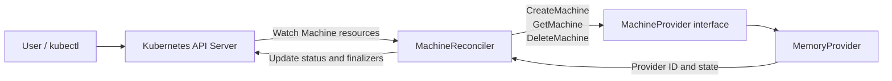

# Kubernetes Machine Operator

[](https://github.com/yevhenii-poliakov/machine-operator/actions/workflows/lint.yml)
[](https://github.com/yevhenii-poliakov/machine-operator/actions/workflows/test.yml)
[](https://github.com/yevhenii-poliakov/machine-operator/actions/workflows/test-e2e.yml)

## About This Project

This project was created as a hiring task for a Kubernetes Machine Operator.

At the start of the task, Go, Kubebuilder, and controller-runtime were new to
me. I used the implementation as an opportunity to learn how Kubernetes
controllers reconcile desired and observed state, how Go interfaces can be used
to separate responsibilities, and how finalizers protect external resources
during deletion.

My goal was not to build a production-ready cloud provider. Instead, I focused
on creating a small and working implementation whose behavior, code, and design
decisions I can explain.

The operator manages infrastructure machines represented by a custom Kubernetes
`Machine` resource. It delegates infrastructure operations to a provider
interface and synchronizes the observed provider state back to the Kubernetes
resource status.

The current provider stores machines in memory and is intentionally simple. This
keeps the focus on the reconciliation loop and the Kubernetes resource
lifecycle.

Installing Kubernetes on the provisioned machines is outside the scope of this
project.

## Features

- Kubernetes `Machine` Custom Resource Definition
- Declarative machine configuration through `spec`
- Infrastructure abstraction through the `MachineProvider` interface
- Concurrency-safe in-memory provider
- Infrastructure machine creation
- Provider-state synchronization through the Kubernetes `status` subresource
- Finalizer-based infrastructure cleanup
- Idempotent repeated reconciliation after the provider ID has been persisted
- Periodic provider-state polling
- Provider unit tests
- Controller integration tests using `envtest`
- GitHub Actions for linting, testing, and end-to-end validation
- Manually verified creation and deletion lifecycle

## Machine Resource

A user describes the desired infrastructure machine through a Kubernetes
resource:

```yaml
apiVersion: infrastructure.example.com/v1alpha1
kind: Machine
metadata:
  name: worker-01
spec:
  image: ubuntu-24.04
  flavor: medium
  region: vienna
```

The controller communicates with the provider and writes the observed state to
`status`:

```yaml
status:
  providerID: machine-00001
  state: Running
```

The user owns the desired state in `spec`, while the controller owns the
observed state in `status`.

## Architecture



The reconciler depends on the `MachineProvider` interface rather than directly
on the in-memory implementation.

I introduced this interface so that the reconciler does not need to know whether
a machine is stored in memory, created through a REST API, or provisioned by a
real cloud provider.

For this task, the concrete implementation is `MemoryProvider`. A different
provider could be injected without rewriting the main reconciliation flow.

One `MemoryProvider` instance is created when the manager starts and is passed
to the reconciler.

Creating a new provider inside `Reconcile` would create a fresh empty map on
every call. Previously created provider machines could then no longer be found.

The provider protects its internal map with `sync.RWMutex`, because
controller-runtime can potentially reconcile multiple resources concurrently.

## Reconciliation Flow

For each reconciliation request, the controller performs the following steps:

1. Fetch the `Machine` resource from the Kubernetes API.
2. Return successfully if the resource no longer exists.
3. Handle deletion when `metadata.deletionTimestamp` is set.
4. Ensure that the operator finalizer exists before creating infrastructure.
5. Create a provider machine when `status.providerID` is empty.
6. Retrieve the current machine state from the provider.
7. Update the Kubernetes status only when the observed state has changed.
8. Requeue the resource after 30 seconds to check the provider state again.

### Creation

The first reconciliation adds the finalizer to the Kubernetes resource and
returns.

A subsequent reconciliation calls `CreateMachine`, receives a provider ID,
retrieves the provider state, and updates the resource:

```yaml
status:
  providerID: machine-00001
  state: Running
```

After the provider ID has been persisted, later reconciliations use
`GetMachine` instead of creating another provider machine.

This makes normal repeated reconciliation idempotent.

### Status Synchronization

The controller compares the state reported by the provider with the current
Kubernetes status.

It only calls `Status().Update` when the values have changed.

This avoids unnecessary API writes and prevents a loop in which every status
update causes another reconciliation and another identical status update.

The controller requeues each managed machine after 30 seconds because changes
inside an external infrastructure provider do not automatically generate
Kubernetes events.

### Deletion

When a user deletes a `Machine`, Kubernetes sets
`metadata.deletionTimestamp`.

The resource remains in Kubernetes while the operator finalizer is still
present.

The controller then:

1. Checks whether the operator finalizer exists.
2. Calls `DeleteMachine` when the resource has a provider ID.
3. Keeps the finalizer when provider cleanup fails.
4. Removes the finalizer after successful cleanup.
5. Allows Kubernetes to permanently remove the custom resource.

This prevents the Kubernetes object from disappearing before its external
infrastructure has been cleaned up.

## Project Structure

```text
api/v1alpha1/
    machine_types.go              Machine API types and validation markers
    zz_generated.deepcopy.go     Generated deepcopy implementations

internal/controller/
    machine_controller.go        Reconciliation and finalizer logic
    machine_controller_test.go   Controller integration tests using envtest

internal/provider/
    provider.go                  Provider interface and state types
    memory.go                    In-memory provider implementation
    memory_test.go               Provider unit tests

config/
    crd/                         Generated Custom Resource Definition
    rbac/                        Generated RBAC resources
    samples/                     Example Machine resource

cmd/
    main.go                      Manager setup and dependency wiring
```

Generated files such as CRDs and deepcopy implementations are produced from the
Go types and Kubebuilder markers. They should not be edited manually.

## Provider Interface

The reconciler communicates with the infrastructure layer through a small
interface:

```go
type MachineProvider interface {
	CreateMachine(
		ctx context.Context,
		spec infrastructurev1alpha1.MachineSpec,
	) (string, error)

	GetMachine(
		ctx context.Context,
		providerID string,
	) (*MachineState, error)

	DeleteMachine(
		ctx context.Context,
		providerID string,
	) error
}
```

The interface describes only the operations required by the controller:

- create a machine from the desired specification;
- retrieve the current provider state;
- delete a machine by its provider ID.

The provider returns data to the controller, but it does not update Kubernetes
resources itself.

This keeps the responsibilities separated:

```text
Provider:
    knows how infrastructure machines are managed

Controller:
    knows how Kubernetes resources are reconciled
```

## In-Memory Provider

`MemoryProvider` stores machines in a Go map using their provider ID as the key.

Example internal state:

```text
machine-00001 -> Running
machine-00002 -> Running
```

New machines receive sequential IDs such as:

```text
machine-00001
machine-00002
```

A newly created machine immediately enters the `Running` state.

The map and ID counter are protected by `sync.RWMutex`:

- write locks are used while creating or deleting machines;
- read locks are used while retrieving machine state.

Deletion is idempotent. Deleting an already absent provider machine is treated
as success because the desired result — the machine no longer existing — has
already been reached.

## Prerequisites

Local development requires:

- Go compatible with the version declared in `go.mod`
- GNU Make
- Docker
- `kubectl`
- access to a Kubernetes cluster
- `kind` for the generated end-to-end test workflow

The Makefile downloads project tools into the local `bin/` directory when they
are required.

## Build and Quality Checks

Run the linter:

```bash
make lint
```

Run unit and controller integration tests:

```bash
make test
```

Build all Go packages:

```bash
go build ./...
```

Run the generated end-to-end test suite:

```bash
make test-e2e
```

The controller integration tests use `envtest`.

`envtest` starts a local Kubernetes API server and `etcd` without requiring a
complete Kubernetes cluster. This allows the tests to verify CRD validation,
status updates, finalizer behavior, and interaction with the Kubernetes API.

## Run Locally

The following lifecycle was manually tested against a local Kubernetes cluster.

### 1. Install the CRD

```bash
make install
```

Verify that it exists:

```bash
kubectl get crd machines.infrastructure.example.com
```

### 2. Start the controller

```bash
make run
```

Keep this terminal open. The manager continues running until it receives a
shutdown signal.

### 3. Create a Machine

Open another terminal and apply the sample resource:

```bash
kubectl apply \
  -f config/samples/infrastructure_v1alpha1_machine.yaml
```

Inspect the resource:

```bash
kubectl get machines
kubectl get machine worker-01 -o yaml
```

The resource should contain the operator finalizer:

```yaml
metadata:
  finalizers:
    - infrastructure.example.com/machine-finalizer
```

It should also contain the provider status:

```yaml
status:
  providerID: machine-00001
  state: Running
```

The controller logs should include messages similar to:

```text
Added finalizer to Machine
Created machine in infrastructure provider
Updated Machine status
```

### 4. Delete the Machine

```bash
kubectl delete machine worker-01
```

The controller deletes the machine from the provider, removes its finalizer,
and allows Kubernetes to remove the custom resource.

The logs should include:

```text
Deleted machine from infrastructure provider
```

Verify that the resource is gone:

```bash
kubectl get machine worker-01
```

The Kubernetes API should report that the resource no longer exists.

### 5. Stop the controller

Press:

```text
Ctrl+C
```

The `make run` command may end with a non-zero exit status because the process
was interrupted manually. The manager should still perform a graceful shutdown
and wait for its workers and caches to stop.

### 6. Remove the CRD

```bash
make uninstall
```

## Container Deployment

Build the controller image:

```bash
make docker-build IMG=<registry>/machine-operator:<tag>
```

Push the image:

```bash
make docker-push IMG=<registry>/machine-operator:<tag>
```

Deploy the operator to the current Kubernetes cluster:

```bash
make deploy IMG=<registry>/machine-operator:<tag>
```

Remove the deployment:

```bash
make undeploy
```

The current provider stores all state in the manager process. Restarting the
deployed manager therefore resets the provider state.

## Testing Strategy

The project uses several testing levels.

### Provider Unit Tests

The provider tests use Go's standard `testing` package.

They verify:

- machine creation;
- deterministic provider IDs;
- machine-state retrieval;
- missing-machine errors;
- machine deletion;
- idempotent repeated deletion.

These tests are fast and do not require Kubernetes.

### Controller Integration Tests

The controller tests use Ginkgo, Gomega, and `envtest`.

They verify:

- adding the finalizer;
- creating a provider machine;
- persisting the provider ID and state;
- repeated reconciliation without creating another provider machine;
- provider cleanup during deletion;
- removal of the Kubernetes resource after finalizer cleanup.

### End-to-End Workflow

The generated end-to-end workflow starts a temporary Kubernetes cluster and
validates the manager deployment.

### Manual Smoke Test

The complete custom-resource lifecycle was also verified manually:

```text
Create Machine
    -> Add finalizer
    -> Create provider machine
    -> Update status
    -> Delete Machine
    -> Delete provider machine
    -> Remove finalizer
    -> Remove Kubernetes resource
```

The repository is additionally checked with:

- `gofmt`
- `goimports`
- `go vet`
- `golangci-lint`
- GitHub Actions

## Design Decisions

### Keep the implementation small

The task allowed an in-memory provider, a mock service, or a small REST API.

I selected an in-memory implementation because it keeps the project focused on
the Kubernetes reconciliation model rather than on HTTP handling,
authentication, networking, or a specific cloud platform.

This also made it possible to test the provider logic independently.

### Depend on an interface

`MachineReconciler` depends on `MachineProvider`, not directly on
`MemoryProvider`.

This made dependency injection possible and kept the controller independent
from the provider implementation.

Go interfaces are implemented implicitly, so `MemoryProvider` satisfies the
interface by having methods with the required names and signatures.

A compile-time assertion is used to verify this:

```go
var _ MachineProvider = (*MemoryProvider)(nil)
```

### Use pointer receivers

The memory provider methods use pointer receivers:

```go
func (p *MemoryProvider) CreateMachine(...)
```

The methods need to modify the same provider instance, including its map and ID
counter.

Using pointer receivers also avoids copying a structure that contains a mutex.

### Pass context through provider operations

Each provider method accepts `context.Context`.

The in-memory implementation performs operations immediately, but a real
provider might make network requests. Passing the reconciliation context would
allow those requests to be cancelled when the reconciliation is cancelled or
the manager shuts down.

### Add the finalizer before creating infrastructure

The controller stores its finalizer before calling `CreateMachine`.

Without this ordering, a resource could theoretically be deleted after the
external machine was created but before the finalizer was persisted. The
controller would then lose its opportunity to clean up the provider machine.

### Keep the finalizer after cleanup errors

When `DeleteMachine` returns an error, the controller does not remove the
finalizer.

The Kubernetes resource remains in the terminating state, and
controller-runtime can retry the reconciliation.

This favors infrastructure cleanup over immediately removing the Kubernetes
object.

### Avoid unnecessary status updates

The controller compares the existing Kubernetes status with the state returned
by the provider.

It only writes to the API server when something has changed. This prevents
unnecessary updates and avoids creating an endless status-update reconciliation
loop.

### Poll the provider state

The in-memory provider does not generate Kubernetes events when its state
changes.

The controller therefore uses `RequeueAfter` to check the provider state again
after 30 seconds.

A real provider integration could use the same polling approach or introduce a
separate event mechanism.

## What I Learned

This was my first practical project using Go, Kubebuilder, and
controller-runtime.

The main Go concepts I worked with were:

- structs and methods;
- interfaces and implicit interface implementation;
- pointer receivers;
- maps;
- constructors by convention;
- `context.Context`;
- multiple return values;
- error wrapping with `%w`;
- checking wrapped errors with `errors.Is`;
- `defer`;
- `sync.RWMutex`;
- compile-time interface assertions;
- unit tests with the standard `testing` package.

The main Kubernetes concepts I worked with were:

- Custom Resource Definitions;
- desired state in `spec`;
- observed state in `status`;
- status subresources;
- reconciliation loops;
- idempotent controller behavior;
- controller-runtime clients;
- finalizers;
- deletion timestamps;
- RBAC markers;
- generated CRD manifests;
- integration testing with `envtest`.

One of the most useful lessons was that a Kubernetes controller should not be
implemented as a sequence of one-time events.

`Reconcile` may run repeatedly because of updates, polling, retries, restarts,
or duplicate events. Each invocation should inspect the current state and move
it toward the desired state without unnecessarily repeating external
operations.

I also learned why dependencies such as the provider should be created outside
the reconciliation function and injected into the reconciler.

Working in small steps, testing each layer, and committing logical changes
separately made it easier to understand the generated Kubebuilder project and
distinguish generated code from code that should be maintained manually.

## Limitations and Production Considerations

This implementation is intentionally scoped to the hiring task. It is not a
complete production infrastructure provider.

Known limitations include:

- provider state is lost when the operator process restarts;
- machines transition directly to `Running`;
- asynchronous provisioning is not simulated;
- changes to an existing machine specification are not reconciled;
- the provider does not use an external API or persistent database;
- provider authentication is not implemented;
- provider-specific retries and rate limiting are not implemented;
- Kubernetes `Conditions` are not used;
- `observedGeneration` is not tracked;
- custom Kubernetes events and metrics are not implemented;
- `CreateMachine` does not accept an idempotency key.

The last limitation creates an important failure scenario:

```text
CreateMachine succeeds
    -> controller process crashes
    -> status.providerID is not persisted
    -> later reconciliation creates another machine
```

The current reconciliation is idempotent after the provider ID has been stored
in Kubernetes, but it cannot fully protect against a crash between the external
create operation and the status update.

A production provider should accept a stable idempotency key, such as the
Kubernetes `Machine` UID, and return the same infrastructure resource when the
request is repeated.

Persistent provider state would also be required so that the provider remains
consistent after manager restarts.

## Possible Extensions

Possible next steps include:

- a REST-based provider implementation;
- integration with a real cloud platform;
- persistent provider state;
- idempotent creation based on the Kubernetes resource UID;
- asynchronous states such as `Creating`, `Running`, `Failed`, and `Deleting`;
- Kubernetes `Conditions`;
- `observedGeneration`;
- reconciliation of specification changes;
- provider retry and backoff policies;
- Kubernetes events;
- custom Prometheus metrics;
- additional failure-path tests.

## Use of Documentation and AI Tools

Since Go and controller-runtime were new to me, I used documentation and AI
tools as part of the learning process.

The main resources and tools were:

- the official Go documentation;
- the Tour of Go;
- the Kubebuilder documentation;
- the controller-runtime documentation;
- the Kubernetes documentation for custom resources and finalizers;
- ChatGPT for concept explanations, environment troubleshooting, planning, and
  step-by-step implementation review;
- Claude Code for repository-aware explanations and code review;
- VS Code with the official Go extension for navigation, formatting,
  diagnostics, and test execution.

I did not use AI as a one-command implementation generator.

I worked through the project in small steps, reviewed proposed changes, ran the
relevant checks, and made sure I understood the concepts introduced into the
codebase.

AI suggestions were treated as input for review rather than as automatically
trusted output.

All committed code was formatted, linted, built, and tested locally and through
GitHub Actions.

## Current Status

The following checks currently pass:

```text
Lint          PASS
Tests         PASS
E2E Tests     PASS
Manual smoke  PASS
```

The complete implemented lifecycle is:

```text
Machine resource created
    -> finalizer added
    -> provider machine created
    -> provider state written to status
    -> repeated reconciliation reads existing provider machine
    -> deletion requested
    -> provider machine deleted
    -> finalizer removed
    -> Kubernetes resource deleted
```